Lightricks datahack challenge
================
Iyar Lin
07 October, 2018

-   [General](#general)
-   [Load data and baseline features engineering](#load-data-and-baseline-features-engineering)
    -   [Subscription local hour](#subscription-local-hour)
    -   [Subscription day of week](#subscription-day-of-week)
    -   [Country grouping](#country-grouping)
    -   [App and ios versions](#app-and-ios-versions)
    -   [Installation date vs subscription date](#installation-date-vs-subscription-date)
-   [usage features engineering](#usage-features-engineering)
    -   [Usage duration](#usage-duration)
        -   [Average long usage duration](#average-long-usage-duration)
        -   [Average usage duration](#average-usage-duration)
            -   [Average usage duration by feature](#average-usage-duration-by-feature)
    -   [Day of usage](#day-of-usage)
    -   [Usage count](#usage-count)
        -   [Usage count variable](#usage-count-variable)
            -   [Usage count by feature](#usage-count-by-feature)
    -   [feature acceptance](#feature-acceptance)
        -   [Usage count variable](#usage-count-variable-1)
            -   [Feature acceptence](#feature-acceptence)
-   [Model fitting](#model-fitting)
    -   [Create task and split to train and test](#create-task-and-split-to-train-and-test)
    -   [set up learners](#set-up-learners)
-   [Benchmarking](#benchmarking)
-   [submit predictions](#submit-predictions)

General
=======

In this challenge I'll be utilizing as much as possible from the r package "mlr" (except for data preparation, as there's no missing data). I'll be committing every run with the F1 score.

Load data and baseline features engineering
===========================================

Should look at option to use days beyond 28.

``` r
train_users <- read_csv("train_users_data.csv") %>% 
  select(-c(X1, days_until_churn)) %>% 
  mutate(id = as.character(id))

train_usage <- read_csv("train_usage_data.csv") %>% 
  mutate(id = as.character(id))
test_users <- read_csv("test_users_data.csv") %>% 
  select(-X1) %>% 
  mutate(id = as.character(id))

test_usage <- read_csv("test_usage_data.csv") %>% 
  mutate(id = as.character(id))

users <- train_users %>% 
  mutate(dataset = "train") %>% 
  bind_rows(test_users %>% mutate(dataset = "test"))

usage <- train_usage %>% 
  mutate(dataset = "train") %>% 
  bind_rows(test_usage %>% mutate(dataset = "test"))
```

Subscription local hour
-----------------------

I'm using a dataset from <https://www.countries-ofthe-world.com/world-time-zones.html> to find local time in each country.

``` r
UTC_offset <- read_csv("UTC_offset.csv")

users <- users %>% 
  mutate(country = replace(country, grepl("land Islands", country), "Aland Islands"), 
         country = replace(country, is.na(country), "United States")) %>% # most common country
  left_join(UTC_offset, by = "country") %>% 
  mutate(local_subscription_datetime = subscripiton_date + offset * 60 * 60, 
         local_subscription_hour = factor(as.numeric(format(local_subscription_datetime, "%H"))))

users %>% filter(dataset == "train") %>% 
  group_by(local_subscription_hour) %>% summarise(churned = mean(churned)) %>% 
  ggplot(aes(local_subscription_hour, churned)) + geom_col() + scale_y_continuous(labels = scales::percent)
```


``` r
users %>% filter(dataset == "train") %>% 
  group_by(local_subscription_hour) %>% summarise(n = n()) %>% 
  ggplot(aes(local_subscription_hour, n)) + geom_col()
```


Subscription day of week
------------------------

``` r
users <- users %>% 
  mutate(subscripiton_day_of_week = factor(wday(local_subscription_datetime, label = T), ordered = F))
  
users %>% filter(dataset == "train") %>% 
  group_by(subscripiton_day_of_week) %>% summarise(churned = mean(churned)) %>% 
  ggplot(aes(subscripiton_day_of_week, churned)) + geom_col() + scale_y_continuous(labels = scales::percent)
```


``` r
users %>% filter(dataset == "train") %>% 
  group_by(subscripiton_day_of_week) %>% summarise(n = n()) %>% 
  ggplot(aes(subscripiton_day_of_week, n)) + geom_col()
```


Country grouping
----------------

``` r
users <- users %>% 
  mutate(country = factor(case_when(
           country %in% c("Sweden", "Netherlands", "Norway", "Denmark", "Ireland", "New Zealand", "Finland", "Germany", "Israel", "Belgium", "Switzerland", "France", "Spain", "Austria", "Italy", "Japan", "Iceland", "Andorra", "Portugal", "Monaco", "Malta", "Guernsey") ~ "Other developed",
           country %in% c("Romania", "Russia", "Poland", "Czechia", "Greece", "Ukraine", "Lithuania", "Hungary", "Slovakia", "Latvia", "Cyprus", "Bulgaria", "Moldova", "Kosovo", "Estonia", "Croatia", "Albania") ~ "Eastern Europe", 
           country %in% c("United States", "United Kingdom", "Australia", "Canada") ~ country,
           TRUE ~ "Other"
         ))
         )

pandoc.table(users %>% filter(dataset == "train") %>% group_by(country) %>% summarise(subscribers = n()))
```

<table style="width:43%;">
<colgroup>
<col width="25%" />
<col width="18%" />
</colgroup>
<thead>
<tr class="header">
<th align="center">country</th>
<th align="center">subscribers</th>
</tr>
</thead>
<tbody>
<tr class="odd">
<td align="center">Australia</td>
<td align="center">344</td>
</tr>
<tr class="even">
<td align="center">Canada</td>
<td align="center">267</td>
</tr>
<tr class="odd">
<td align="center">Eastern Europe</td>
<td align="center">126</td>
</tr>
<tr class="even">
<td align="center">Other</td>
<td align="center">325</td>
</tr>
<tr class="odd">
<td align="center">Other developed</td>
<td align="center">425</td>
</tr>
<tr class="even">
<td align="center">United Kingdom</td>
<td align="center">442</td>
</tr>
<tr class="odd">
<td align="center">United States</td>
<td align="center">5069</td>
</tr>
</tbody>
</table>

``` r
users %>% filter(dataset == "train") %>% 
  group_by(country) %>% summarise(churned = mean(churned)) %>% 
  mutate(country = factor(country, levels = country[order(churned, decreasing = T)])) %>% 
  ggplot(aes(country, churned)) + geom_col() + scale_y_continuous(labels = scales::percent)
```


App and ios versions
--------------------

``` r
users <- users %>% 
  mutate(initial_app_version = factor(substr(initial_app_version, 1, 3)), 
         initial_ios_version = factor(gsub(pattern = "\\..+", "", initial_ios_version)))

users %>% filter(dataset == "train") %>% 
  group_by(initial_app_version) %>% summarise(churned = mean(churned)) %>% 
  mutate(initial_app_version = factor(initial_app_version, levels = initial_app_version[order(churned, decreasing = T)])) %>% ggplot(aes(initial_app_version, churned)) + geom_col() + scale_y_continuous(labels = scales::percent)
```

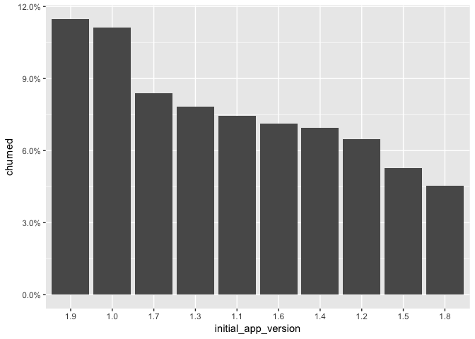

``` r
users %>% filter(dataset == "train") %>% 
  group_by(initial_ios_version) %>% summarise(churned = mean(churned)) %>% 
  mutate(initial_ios_version = factor(initial_ios_version, levels = initial_ios_version[order(churned, decreasing = T)])) %>% ggplot(aes(initial_ios_version, churned)) + geom_col() + scale_y_continuous(labels = scales::percent)
```

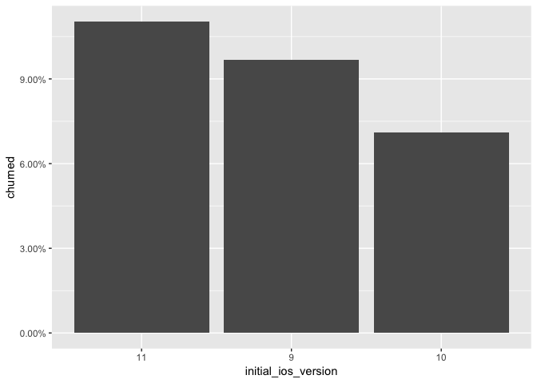

``` r
pandoc.table(users %>% 
               filter(dataset == "train") %>% 
     group_by(initial_device) %>% 
     summarise(churned = mean(churned), n = n()) %>% 
 arrange(churned))
```

<table style="width:61%;">
<colgroup>
<col width="38%" />
<col width="13%" />
<col width="8%" />
</colgroup>
<thead>
<tr class="header">
<th align="center">initial_device</th>
<th align="center">churned</th>
<th align="center">n</th>
</tr>
</thead>
<tbody>
<tr class="odd">
<td align="center">UIDeviceKindIPadMini3G</td>
<td align="center">0</td>
<td align="center">3</td>
</tr>
<tr class="even">
<td align="center">UIDeviceKindIPod6G</td>
<td align="center">0</td>
<td align="center">6</td>
</tr>
<tr class="odd">
<td align="center">UIDeviceKindUnknownIPad</td>
<td align="center">0</td>
<td align="center">8</td>
</tr>
<tr class="even">
<td align="center">UIDeviceKindUnknownIPhone</td>
<td align="center">0.05195</td>
<td align="center">77</td>
</tr>
<tr class="odd">
<td align="center">UIDeviceKindIPhone8</td>
<td align="center">0.08312</td>
<td align="center">397</td>
</tr>
<tr class="even">
<td align="center">UIDeviceKindIPhone6SPlus</td>
<td align="center">0.08832</td>
<td align="center">351</td>
</tr>
<tr class="odd">
<td align="center">UIDeviceKindIPhone7Plus</td>
<td align="center">0.09144</td>
<td align="center">1367</td>
</tr>
<tr class="even">
<td align="center">UIDeviceKindIPhoneX</td>
<td align="center">0.09302</td>
<td align="center">1032</td>
</tr>
<tr class="odd">
<td align="center">UIDeviceKindIPhone7</td>
<td align="center">0.1011</td>
<td align="center">1227</td>
</tr>
<tr class="even">
<td align="center">UIDeviceKindIPhone6S</td>
<td align="center">0.1082</td>
<td align="center">758</td>
</tr>
<tr class="odd">
<td align="center">UIDeviceKindIPhoneSE</td>
<td align="center">0.1149</td>
<td align="center">148</td>
</tr>
<tr class="even">
<td align="center">UIDeviceKindIPhone6</td>
<td align="center">0.1187</td>
<td align="center">379</td>
</tr>
<tr class="odd">
<td align="center">UIDeviceKindIPhone8Plus</td>
<td align="center">0.1231</td>
<td align="center">877</td>
</tr>
<tr class="even">
<td align="center">UIDeviceKindIPadAir2G</td>
<td align="center">0.1282</td>
<td align="center">39</td>
</tr>
<tr class="odd">
<td align="center">UIDeviceKindIPadMini4G</td>
<td align="center">0.1333</td>
<td align="center">15</td>
</tr>
<tr class="even">
<td align="center">UIDeviceKindIPhone5S</td>
<td align="center">0.1373</td>
<td align="center">51</td>
</tr>
<tr class="odd">
<td align="center">UIDeviceKindIPhone6Plus</td>
<td align="center">0.1377</td>
<td align="center">138</td>
</tr>
<tr class="even">
<td align="center">UIDeviceKindIPadAir1G</td>
<td align="center">0.1429</td>
<td align="center">14</td>
</tr>
<tr class="odd">
<td align="center">UIDeviceKindIPadMini2G</td>
<td align="center">0.1667</td>
<td align="center">6</td>
</tr>
<tr class="even">
<td align="center">UIDeviceKindIPadPro2G12_9</td>
<td align="center">0.1765</td>
<td align="center">17</td>
</tr>
<tr class="odd">
<td align="center">UIDeviceKindIPadPro9_7</td>
<td align="center">0.1818</td>
<td align="center">22</td>
</tr>
<tr class="even">
<td align="center">UIDeviceKindIPadPro10_5</td>
<td align="center">0.1905</td>
<td align="center">21</td>
</tr>
<tr class="odd">
<td align="center">UIDeviceKindIPad5G</td>
<td align="center">0.2308</td>
<td align="center">26</td>
</tr>
<tr class="even">
<td align="center">UIDeviceKindIPadPro12_9</td>
<td align="center">0.2632</td>
<td align="center">19</td>
</tr>
</tbody>
</table>

Some of these are pretty small groups so we'll do some grouping:

``` r
users <- users %>% 
  mutate(initial_device = factor(case_when(
    initial_device %in% c("UIDeviceKindIPadMini3G", "UIDeviceKindIPod6G", "UIDeviceKindUnknownIPad", 
                          "UIDeviceKindUnknownIPhone") ~ "Other_low",
    initial_device %in% c("UIDeviceKindIPadAir2G", "UIDeviceKindIPadMini4G", "UIDeviceKindIPhone5S") ~ "Other_med", 
    initial_device %in% c("UIDeviceKindIPadAir1G", "UIDeviceKindIPadMini2G", "UIDeviceKindIPadPro2G12_9", 
                          "UIDeviceKindIPadPro9_7", "UIDeviceKindIPadPro10_5", "UIDeviceKindIPad5G", "UIDeviceKindIPadPro12_9") ~ "Other_high", 
    TRUE ~ initial_device
  )))

users %>% filter(dataset == "train") %>% 
  group_by(initial_device) %>% summarise(churned = mean(churned)) %>% 
  mutate(initial_device = factor(initial_device, levels = initial_device[order(churned, decreasing = T)])) %>% ggplot(aes(initial_device, churned)) + geom_col() + scale_y_continuous(labels = scales::percent) + theme(axis.text.x = element_text(angle = 90))
```

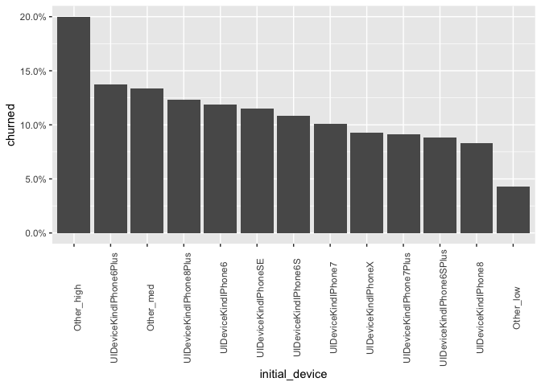

Installation date vs subscription date
--------------------------------------

We can see below that subscribers were chosen based on subscription date, with installation date potentially very far in the past:

``` r
users <- users %>% 
  mutate(installation_date = as.Date(installation_date))

users %>% filter(dataset == "train") %>% 
  ggplot(aes(installation_date)) + geom_histogram(binwidth = 1)
```

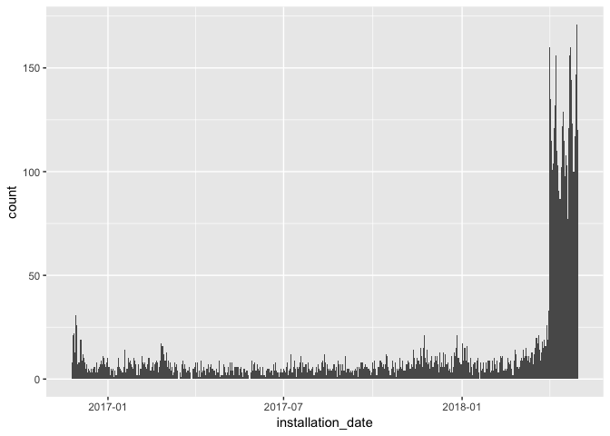

We'll bucket the difference between installation and subscription times.

``` r
users <- users %>% 
  mutate(subscripiton_date = as.Date(subscripiton_date), 
         days_until_subscription = as.numeric(subscripiton_date - installation_date), 
         days_until_subscription_fac = cut(days_until_subscription, unique(quantile(days_until_subscription, seq(0, 1, .1))), include.lowest = T))

users %>% filter(dataset == "train") %>% 
  group_by(days_until_subscription_fac) %>% summarise(churned = mean(churned)) %>% 
  ggplot(aes(days_until_subscription_fac, churned)) + geom_col()
```

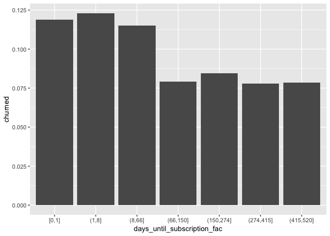

Baseline features summary:

``` r
users <- users %>% 
  select(id, country, initial_app_version, initial_ios_version, initial_device, 
         churned, local_subscription_hour, subscripiton_day_of_week, days_until_subscription_fac, dataset)

data.frame(variable = names(users),
           class = unname(sapply(users, class)),
           first_values = sapply(users, function(x) paste0(head(x, 4),  collapse = ", ")),
           row.names = NULL) %>% 
  pandoc.table(caption = "Baseline features dataset")
```

<table style="width:97%;">
<caption>Baseline features dataset</caption>
<colgroup>
<col width="41%" />
<col width="16%" />
<col width="38%" />
</colgroup>
<thead>
<tr class="header">
<th align="center">variable</th>
<th align="center">class</th>
<th align="center">first_values</th>
</tr>
</thead>
<tbody>
<tr class="odd">
<td align="center">id</td>
<td align="center">character</td>
<td align="center">100000415577994, 100000415580508, 100000415636784, 100000415750897</td>
</tr>
<tr class="even">
<td align="center">country</td>
<td align="center">factor</td>
<td align="center">Canada, Other developed, United States, Other</td>
</tr>
<tr class="odd">
<td align="center">initial_app_version</td>
<td align="center">factor</td>
<td align="center">1.9, 1.7, 1.6, 1.9</td>
</tr>
<tr class="even">
<td align="center">initial_ios_version</td>
<td align="center">factor</td>
<td align="center">11, 11, 10, 11</td>
</tr>
<tr class="odd">
<td align="center">initial_device</td>
<td align="center">factor</td>
<td align="center">UIDeviceKindIPhoneX, UIDeviceKindIPhoneX, UIDeviceKindIPhone6S, Other_med</td>
</tr>
<tr class="even">
<td align="center">churned</td>
<td align="center">integer</td>
<td align="center">0, 0, 0, 0</td>
</tr>
<tr class="odd">
<td align="center">local_subscription_hour</td>
<td align="center">factor</td>
<td align="center">20, 3, 0, 16</td>
</tr>
<tr class="even">
<td align="center">subscripiton_day_of_week</td>
<td align="center">factor</td>
<td align="center">Sat, Sun, Sun, Sun</td>
</tr>
<tr class="odd">
<td align="center">days_until_subscription_fac</td>
<td align="center">factor</td>
<td align="center">(150,274], (415,520], (415,520], (66,150]</td>
</tr>
<tr class="even">
<td align="center">dataset</td>
<td align="center">character</td>
<td align="center">train, train, train, train</td>
</tr>
</tbody>
</table>

usage features engineering
==========================

Usage duration
--------------

``` r
pandoc.table(summary(usage$usage_duration[usage$dataset == "train"]), caption = "Usage duration distribution")
```

<table style="width:72%;">
<caption>Usage duration distribution</caption>
<colgroup>
<col width="11%" />
<col width="13%" />
<col width="12%" />
<col width="11%" />
<col width="13%" />
<col width="9%" />
</colgroup>
<thead>
<tr class="header">
<th align="center">Min.</th>
<th align="center">1st Qu.</th>
<th align="center">Median</th>
<th align="center">Mean</th>
<th align="center">3rd Qu.</th>
<th align="center">Max.</th>
</tr>
</thead>
<tbody>
<tr class="odd">
<td align="center">0.239</td>
<td align="center">8.224</td>
<td align="center">19.7</td>
<td align="center">56.43</td>
<td align="center">45.24</td>
<td align="center">74425</td>
</tr>
</tbody>
</table>

Let's have a closer look at those outliers:

``` r
usage %>% 
  filter(dataset == "train") %>% 
  summarise(p95 = quantile(usage_duration, .95), 
            p99 = quantile(usage_duration, .99), 
            p995 = quantile(usage_duration, .995), 
            p999 = quantile(usage_duration, .999)) %>% 
  pandoc.table(caption = "Usage duration outlier distribution")
```

<table style="width:44%;">
<caption>Usage duration outlier distribution</caption>
<colgroup>
<col width="11%" />
<col width="11%" />
<col width="11%" />
<col width="11%" />
</colgroup>
<thead>
<tr class="header">
<th align="center">p95</th>
<th align="center">p99</th>
<th align="center">p995</th>
<th align="center">p999</th>
</tr>
</thead>
<tbody>
<tr class="odd">
<td align="center">148.8</td>
<td align="center">387.1</td>
<td align="center">636.8</td>
<td align="center">3223</td>
</tr>
</tbody>
</table>

### Average long usage duration

``` r
thresholds <- c(.95, .99, .995, .999)

churn_to_long_usage <- NULL

for(thresh in thresholds){
  churn_to_long_usage <- rbind(churn_to_long_usage, 
                               usage %>% filter(dataset == "train") %>% 
    mutate(high_usage = usage_duration > quantile(usage_duration, thresh)) %>% 
    group_by(id) %>% 
    summarise(high_usage = mean(high_usage)) %>% 
    right_join(users %>% filter(dataset == "train") %>% select(id, churned), by = "id") %>%
    mutate(thresh = thresh))
  
}

churn_to_long_usage %>% ggplot(aes(factor(thresh), high_usage, color = churned)) + geom_boxplot()
```

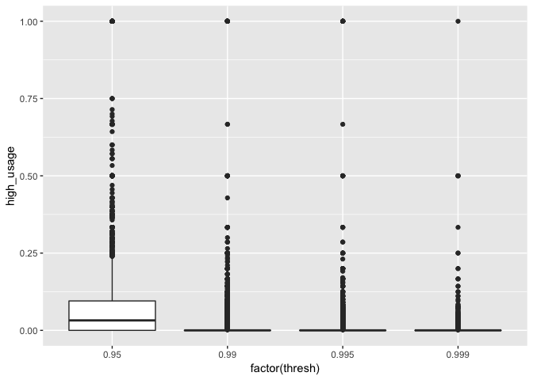

Not amazing either but I'll add another factor variable: "usage higher than 95%" and impute the usage duration values above the 95<sup>th</sup> percentile to be the 95<sup>th</sup> percentile.

``` r
usage <- usage %>% 
  mutate(long_usage_duration = usage_duration >= quantile(usage_duration, .95), 
         usage_duration = replace(usage_duration, usage_duration >= quantile(usage_duration, .95), quantile(usage_duration, .95)))

# add long usage duration
long_usage <- usage %>% 
  group_by(id) %>% 
  summarise(long_usage_duration = mean(long_usage_duration))

users <- users %>% 
  left_join(long_usage, by = "id")
```

### Average usage duration

I'll be using average usage to make these variables a bit more orthogonal to the usage count variables.

``` r
avg_usage_duration <- usage %>% 
  group_by(id) %>% 
  summarise(average_usage_duration = mean(usage_duration))

users <- users %>% 
  left_join(avg_usage_duration, by = "id")

users %>% filter(dataset == "train") %>% 
  ggplot(aes(churned, average_usage_duration)) + geom_boxplot()
```


Doesn't look like much of seperation. Let's try adding binning:

``` r
users <- users %>% 
  mutate(average_usage_duration_fac = cut(average_usage_duration, quantile(average_usage_duration, seq(0, 1, .2)), include.lowest = T))

users %>% filter(dataset == "train") %>% 
  group_by(average_usage_duration_fac) %>% 
  summarise(churned = mean(churned)) %>% 
  ggplot(aes(average_usage_duration_fac, churned)) + geom_col()
```

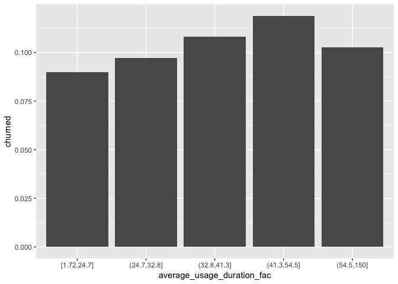

Not amazing but I'll settle for that.

#### Average usage duration by feature

``` r
avg_usage_duration_by_feature <- 
  usage %>% 
  group_by(id, feature_name) %>% 
  summarise(average_usage_duration = mean(usage_duration)) %>% 
  spread(key = feature_name, value = average_usage_duration, fill = 0)

names(avg_usage_duration_by_feature) <- paste0(names(avg_usage_duration_by_feature), ".average_usage_duration")

users <- users %>% 
  left_join(avg_usage_duration_by_feature, by = c("id" = "id.average_usage_duration"))

users %>% 
  filter(dataset == "train") %>% 
  select(id, Adjust.average_usage_duration:Vignette.average_usage_duration) %>% 
  gather(key = "feature_name", value = "average_usage_duration", -id) %>% 
  mutate(feature_name = gsub("\\..+", "", feature_name)) %>% 
  group_by(feature_name) %>% 
  summarise(average_usage_duration = mean(average_usage_duration)) %>% 
  mutate(feature_name = factor(feature_name, levels = feature_name[order(average_usage_duration, decreasing = T)])) %>% ggplot(aes(feature_name, average_usage_duration)) + geom_col() + theme(axis.text.x = element_text(angle = 90))
```

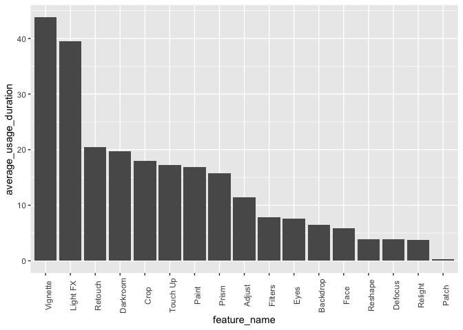

``` r
users %>% filter(dataset == "train") %>% 
  select(id, churned, Adjust.average_usage_duration:Vignette.average_usage_duration) %>% 
  gather(key = "feature_name", value = "average_usage_duration", -c(id, churned)) %>% 
  ggplot(aes(feature_name, average_usage_duration, color = churned)) + 
  geom_boxplot(position = position_dodge()) + theme(axis.text.x = element_text(angle = 90))
```

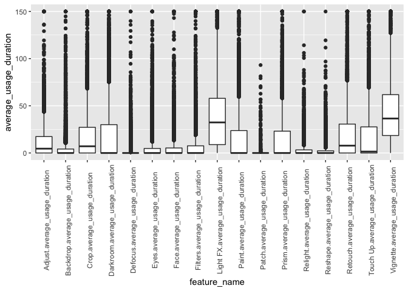

Again, not amazing but I'll take it.

Day of usage
------------

Initially it looks reasonable that the actual day of usage during the first week wouldn't change much since the subscriber is knows to have made the decision to move to day 8. I'll thus use summary statistics without referring to the day they were made at.

Usage count
-----------

``` r
usage_count <- usage %>% 
  group_by(id) %>% 
  summarise(usage_count = n())

pandoc.table(summary(usage_count$usage_count), caption = "Usage count distribution")
```

<table style="width:69%;">
<caption>Usage count distribution</caption>
<colgroup>
<col width="9%" />
<col width="13%" />
<col width="12%" />
<col width="11%" />
<col width="13%" />
<col width="8%" />
</colgroup>
<thead>
<tr class="header">
<th align="center">Min.</th>
<th align="center">1st Qu.</th>
<th align="center">Median</th>
<th align="center">Mean</th>
<th align="center">3rd Qu.</th>
<th align="center">Max.</th>
</tr>
</thead>
<tbody>
<tr class="odd">
<td align="center">1</td>
<td align="center">9</td>
<td align="center">21</td>
<td align="center">37.91</td>
<td align="center">45</td>
<td align="center">1255</td>
</tr>
</tbody>
</table>

Let's have a closer look at those outliers:

``` r
usage_count %>% 
  summarise(p95 = quantile(usage_count, .95), 
            p99 = quantile(usage_count, .99), 
            p995 = quantile(usage_count, .995), 
            p999 = quantile(usage_count, .999)) %>% 
  pandoc.table(caption = "Usage count outlier distribution")
```

<table style="width:39%;">
<caption>Usage count outlier distribution ### High usage count</caption>
<colgroup>
<col width="8%" />
<col width="8%" />
<col width="11%" />
<col width="11%" />
</colgroup>
<thead>
<tr class="header">
<th align="center">p95</th>
<th align="center">p99</th>
<th align="center">p995</th>
<th align="center">p999</th>
</tr>
</thead>
<tbody>
<tr class="odd">
<td align="center">126</td>
<td align="center">251</td>
<td align="center">318.1</td>
<td align="center">532.7</td>
</tr>
</tbody>
</table>

``` r
thresholds <- c(.95, .99, .995, .999)

churn_to_high_usage_count <- NULL

for(thresh in thresholds){
  churn_to_high_usage_count <- rbind(churn_to_high_usage_count, 
                               usage_count %>%
    mutate(high_usage_count = usage_count > quantile(usage_count, thresh)) %>%
    right_join(users %>% filter(dataset == "train") %>%  select(id, churned), by = "id") %>% 
    group_by(high_usage_count) %>% 
    summarise(churned = mean(churned), n = n()) %>% 
      mutate(thresh = thresh))
  
}

churn_to_high_usage_count %>% ggplot(aes(factor(thresh), churned, fill = high_usage_count, label = n)) + geom_col(position = position_dodge()) + scale_y_continuous(labels = scales::percent) + geom_text(position = position_jitterdodge())
```

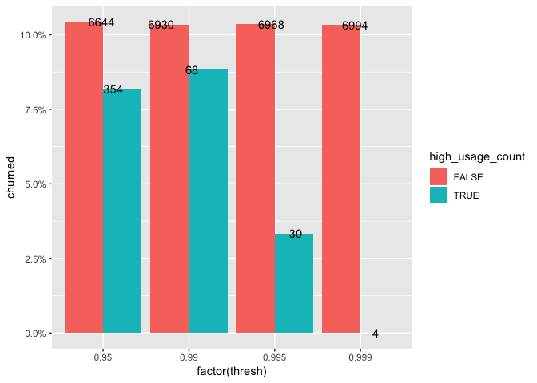

Not amazing either but I'll add another factor variable: "usage count greater than 95%" and impute the usage count values above the 95<sup>th</sup> percentile to be the 95<sup>th</sup> percentile.

``` r
usage_count <- usage_count %>% 
  mutate(high_usage_count = factor(usage_count > quantile(usage_count, .95)), 
         usage_count = replace(usage_count, usage_count > quantile(usage_count, .95), quantile(usage_count, .95)))

# add long usage duration
users <- users %>% 
  left_join(usage_count, by = "id")
```

### Usage count variable

``` r
users %>% filter(dataset == "train") %>% 
  ggplot(aes(factor(churned), usage_count)) + geom_boxplot()
```


Doesn't look like much of seperation. Let's try adding binning:

``` r
users <- users %>% 
  mutate(usage_count_fac = cut(usage_count, quantile(usage_count, seq(0, 1, .125)), include.lowest = T))

users %>% filter(dataset == "train") %>% 
  group_by(usage_count_fac) %>% 
  summarise(churned = mean(churned)) %>% 
  ggplot(aes(usage_count_fac, churned)) + geom_col() + scale_y_continuous(labels = scales::percent)
```

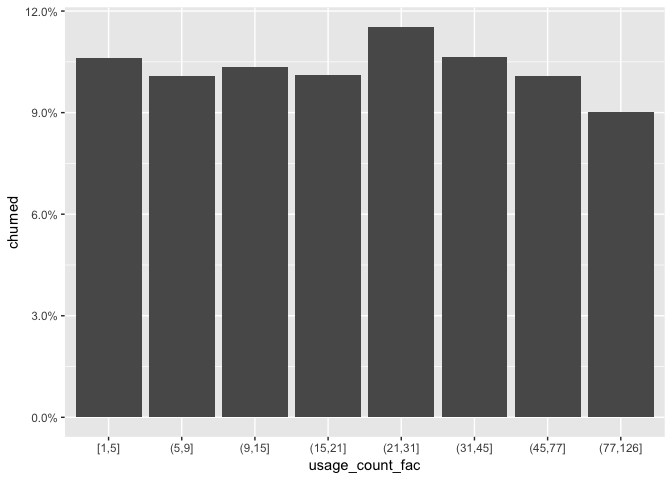

Not amazing but I'll settle for that.

#### Usage count by feature

``` r
usage_count_by_feature <- 
  usage %>% 
  group_by(id, feature_name) %>% 
  summarise(usage_count = n()) %>% 
  group_by(feature_name) %>% 
  mutate(usage_count = replace(usage_count, usage_count > quantile(usage_count, .95), quantile(usage_count, .95))) %>% 
  spread(key = feature_name, value = usage_count, fill = 0)

names(usage_count_by_feature) <- paste0(names(usage_count_by_feature), ".usage_count")

users <- users %>% 
  left_join(usage_count_by_feature, by = c("id" = "id.usage_count"))

users %>% filter(dataset == "train") %>% 
  select(id, Adjust.usage_count:Vignette.usage_count) %>% 
  gather(key = "feature_name", value = "count", -id) %>% 
  mutate(feature_name = gsub("\\..+", "", feature_name)) %>% 
  group_by(feature_name) %>% 
  summarise(count = mean(count)) %>% 
  mutate(feature_name = factor(feature_name, levels = feature_name[order(count, decreasing = T)])) %>% ggplot(aes(feature_name, count)) + geom_col() + theme(axis.text.x = element_text(angle = 90))
```

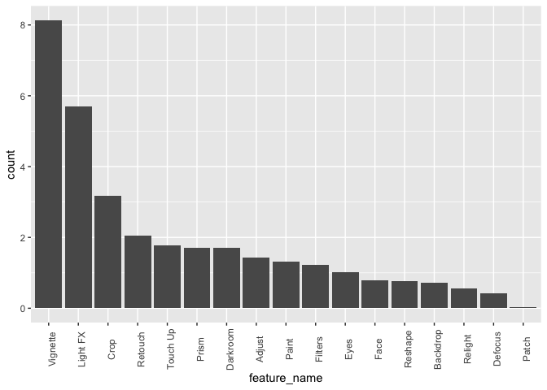

``` r
users %>% 
  filter(dataset == "train") %>% 
  select(id, churned, Adjust.usage_count:Vignette.usage_count) %>% 
  gather(key = "feature_name", value = "count", -c(id, churned)) %>% 
  mutate(feature_name = gsub("\\..+", "", feature_name)) %>% 
  ggplot(aes(feature_name, count, color = churned)) + 
  geom_boxplot(position = position_dodge()) + theme(axis.text.x = element_text(angle = 90))
```

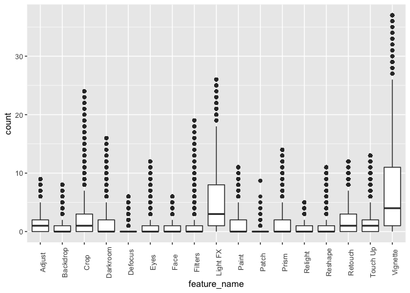

Looks pretty bad... Hope for the best!

feature acceptance
------------------

``` r
accepted <- usage %>% 
  group_by(id) %>% 
  summarise(accepted = mean(accepted))

pandoc.table(summary(accepted$accepted), caption = "Accepted distribution")
```

<table style="width:71%;">
<caption>Accepted distribution</caption>
<colgroup>
<col width="9%" />
<col width="13%" />
<col width="12%" />
<col width="12%" />
<col width="13%" />
<col width="8%" />
</colgroup>
<thead>
<tr class="header">
<th align="center">Min.</th>
<th align="center">1st Qu.</th>
<th align="center">Median</th>
<th align="center">Mean</th>
<th align="center">3rd Qu.</th>
<th align="center">Max.</th>
</tr>
</thead>
<tbody>
<tr class="odd">
<td align="center">0</td>
<td align="center">0.4</td>
<td align="center">0.5526</td>
<td align="center">0.5531</td>
<td align="center">0.7143</td>
<td align="center">1</td>
</tr>
</tbody>
</table>

``` r
# add long usage duration
users <- users %>% 
  left_join(accepted, by = "id")
```

### Usage count variable

``` r
users %>% filter(dataset == "train") %>% 
  ggplot(aes(factor(churned), accepted)) + geom_boxplot()
```

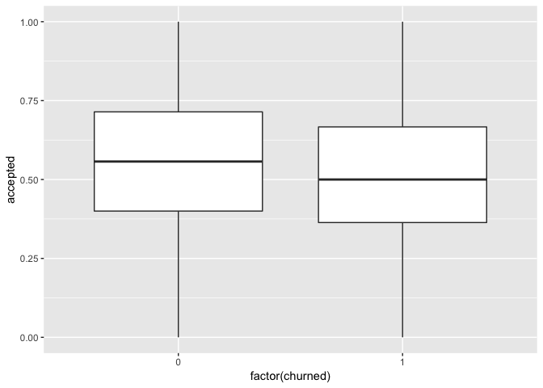

Looking good. Let's just add binning for good measure

``` r
users <- users %>% 
  mutate(accepted_fac = cut(accepted, quantile(accepted, seq(0, 1, .2)), include.lowest = T))

users %>% filter(dataset == "train") %>% 
  group_by(accepted_fac) %>% 
  summarise(churned = mean(churned)) %>% 
  ggplot(aes(accepted_fac, churned)) + geom_col() + scale_y_continuous(labels = scales::percent)
```

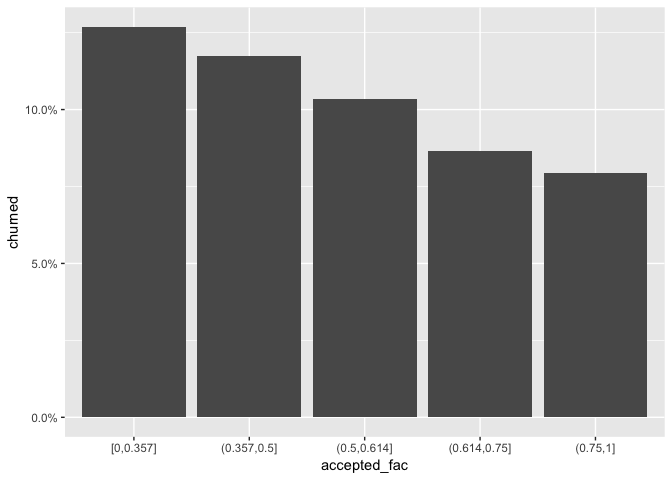

Very nice.

#### Feature acceptence

``` r
usage_accepted_by_feature <- 
  usage %>% 
  group_by(id, feature_name) %>% 
  summarise(accepted = mean(accepted)) %>% 
  group_by(feature_name) %>%
  spread(key = feature_name, value = accepted, fill = 0)

names(usage_accepted_by_feature) <- paste0(names(usage_accepted_by_feature), ".accepted")

users <- users %>% 
  left_join(usage_accepted_by_feature, by = c("id" = "id.accepted"))

users %>% 
  filter(dataset == "train") %>% 
  select(id, Adjust.accepted:Vignette.accepted) %>% 
  gather(key = "feature_name", value = "accepted", -id) %>% 
  mutate(feature_name = gsub("\\..+", "", feature_name)) %>% 
  group_by(feature_name) %>% 
  summarise(accepted = mean(accepted)) %>% 
  mutate(feature_name = factor(feature_name, levels = feature_name[order(accepted, decreasing = T)])) %>% ggplot(aes(feature_name, accepted)) + geom_col() + theme(axis.text.x = element_text(angle = 90))
```

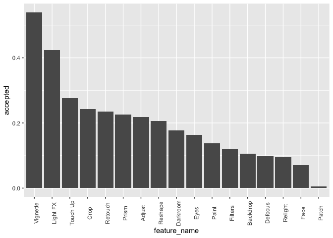

``` r
users %>% 
  filter(dataset == "train") %>% 
  select(id, churned, Adjust.accepted:Vignette.accepted) %>% 
  gather(key = "feature_name", value = "accepted", -c(id, churned)) %>% 
  mutate(feature_name = gsub("\\..+", "", feature_name)) %>% 
  ggplot(aes(feature_name, accepted, color = factor(churned))) + 
  geom_boxplot(position = position_dodge()) + theme(axis.text.x = element_text(angle = 90))
```

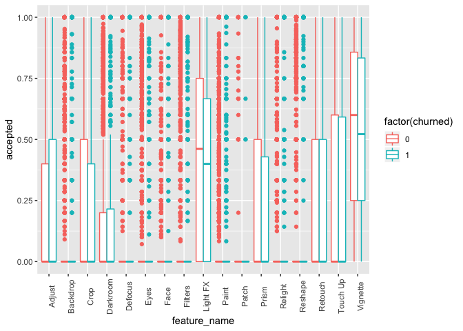

OK.. that's... something...

Model fitting
=============

Create task and split to train and test
---------------------------------------

``` r
names(users) <- make.names(names(users))
churn_task <- makeClassifTask(id = "churn", data = users %>% filter(dataset == "train") %>% select(-c(id, dataset)), target = "churned", positive = "1")

data.frame(variable = names(churn_task$env$data),
           class = unname(sapply(churn_task$env$data, class)),
           first_values = sapply(churn_task$env$data, function(x) paste0(head(x, 4),  collapse = ", ")),
           row.names = NULL) %>% 
  pandoc.table(caption = "Baseline features dataset")
```

<table>
<caption>Baseline features dataset</caption>
<colgroup>
<col width="44%" />
<col width="13%" />
<col width="42%" />
</colgroup>
<thead>
<tr class="header">
<th align="center">variable</th>
<th align="center">class</th>
<th align="center">first_values</th>
</tr>
</thead>
<tbody>
<tr class="odd">
<td align="center">country</td>
<td align="center">factor</td>
<td align="center">Canada, Other developed, United States, Other</td>
</tr>
<tr class="even">
<td align="center">initial_app_version</td>
<td align="center">factor</td>
<td align="center">1.9, 1.7, 1.6, 1.9</td>
</tr>
<tr class="odd">
<td align="center">initial_ios_version</td>
<td align="center">factor</td>
<td align="center">11, 11, 10, 11</td>
</tr>
<tr class="even">
<td align="center">initial_device</td>
<td align="center">factor</td>
<td align="center">UIDeviceKindIPhoneX, UIDeviceKindIPhoneX, UIDeviceKindIPhone6S, Other_med</td>
</tr>
<tr class="odd">
<td align="center">churned</td>
<td align="center">factor</td>
<td align="center">0, 0, 0, 0</td>
</tr>
<tr class="even">
<td align="center">local_subscription_hour</td>
<td align="center">factor</td>
<td align="center">20, 3, 0, 16</td>
</tr>
<tr class="odd">
<td align="center">subscripiton_day_of_week</td>
<td align="center">factor</td>
<td align="center">Sat, Sun, Sun, Sun</td>
</tr>
<tr class="even">
<td align="center">days_until_subscription_fac</td>
<td align="center">factor</td>
<td align="center">(150,274], (415,520], (415,520], (66,150]</td>
</tr>
<tr class="odd">
<td align="center">long_usage_duration</td>
<td align="center">numeric</td>
<td align="center">0.0256410256410256, 0.0263157894736842, 0.166666666666667, 0</td>
</tr>
<tr class="even">
<td align="center">average_usage_duration</td>
<td align="center">numeric</td>
<td align="center">33.1044358974359, 20.4651052631579, 45.8286666666667, 42.0276666666667</td>
</tr>
<tr class="odd">
<td align="center">average_usage_duration_fac</td>
<td align="center">factor</td>
<td align="center">(32.8,41.3], [1.72,24.7], (41.3,54.5], (41.3,54.5]</td>
</tr>
<tr class="even">
<td align="center">Adjust.average_usage_duration</td>
<td align="center">numeric</td>
<td align="center">14.0255, 16.651, 17.769, 0</td>
</tr>
<tr class="odd">
<td align="center">Backdrop.average_usage_duration</td>
<td align="center">numeric</td>
<td align="center">0, 0, 0, 0</td>
</tr>
<tr class="even">
<td align="center">Crop.average_usage_duration</td>
<td align="center">numeric</td>
<td align="center">0, 0, 0, 27.6653333333333</td>
</tr>
<tr class="odd">
<td align="center">Darkroom.average_usage_duration</td>
<td align="center">numeric</td>
<td align="center">0, 137.169, 0, 0</td>
</tr>
<tr class="even">
<td align="center">Defocus.average_usage_duration</td>
<td align="center">numeric</td>
<td align="center">5.124, 0, 0, 0</td>
</tr>
<tr class="odd">
<td align="center">Eyes.average_usage_duration</td>
<td align="center">numeric</td>
<td align="center">36.366, 27.6125, 0, 0</td>
</tr>
<tr class="even">
<td align="center">Face.average_usage_duration</td>
<td align="center">numeric</td>
<td align="center">4.265, 0, 3.146, 0</td>
</tr>
<tr class="odd">
<td align="center">Filters.average_usage_duration</td>
<td align="center">numeric</td>
<td align="center">0, 6.82088, 0, 0</td>
</tr>
<tr class="even">
<td align="center">Light.FX.average_usage_duration</td>
<td align="center">numeric</td>
<td align="center">22.1253333333333, 15.401, 149.906, 53.9792</td>
</tr>
<tr class="odd">
<td align="center">Paint.average_usage_duration</td>
<td align="center">numeric</td>
<td align="center">0, 0, 19.802, 0</td>
</tr>
<tr class="even">
<td align="center">Patch.average_usage_duration</td>
<td align="center">numeric</td>
<td align="center">0, 0, 0, 0</td>
</tr>
<tr class="odd">
<td align="center">Prism.average_usage_duration</td>
<td align="center">numeric</td>
<td align="center">20.251, 51.212, 0, 47.455</td>
</tr>
<tr class="even">
<td align="center">Relight.average_usage_duration</td>
<td align="center">numeric</td>
<td align="center">0, 0, 0, 0</td>
</tr>
<tr class="odd">
<td align="center">Reshape.average_usage_duration</td>
<td align="center">numeric</td>
<td align="center">7.85, 9.541, 0, 0</td>
</tr>
<tr class="even">
<td align="center">Retouch.average_usage_duration</td>
<td align="center">numeric</td>
<td align="center">0, 0, 72.74, 27.638</td>
</tr>
<tr class="odd">
<td align="center">Touch.Up.average_usage_duration</td>
<td align="center">numeric</td>
<td align="center">0, 34.382, 11.609, 0</td>
</tr>
<tr class="even">
<td align="center">Vignette.average_usage_duration</td>
<td align="center">numeric</td>
<td align="center">65.0694166666667, 68.0425, 0, 38.1735</td>
</tr>
<tr class="odd">
<td align="center">usage_count</td>
<td align="center">numeric</td>
<td align="center">39, 38, 6, 12</td>
</tr>
<tr class="even">
<td align="center">high_usage_count</td>
<td align="center">factor</td>
<td align="center">FALSE, FALSE, FALSE, FALSE</td>
</tr>
<tr class="odd">
<td align="center">usage_count_fac</td>
<td align="center">factor</td>
<td align="center">(31,45], (31,45], (5,9], (9,15]</td>
</tr>
<tr class="even">
<td align="center">Adjust.usage_count</td>
<td align="center">numeric</td>
<td align="center">2, 1, 1, 0</td>
</tr>
<tr class="odd">
<td align="center">Backdrop.usage_count</td>
<td align="center">numeric</td>
<td align="center">0, 0, 0, 0</td>
</tr>
<tr class="even">
<td align="center">Crop.usage_count</td>
<td align="center">numeric</td>
<td align="center">0, 0, 0, 3</td>
</tr>
<tr class="odd">
<td align="center">Darkroom.usage_count</td>
<td align="center">numeric</td>
<td align="center">0, 1, 0, 0</td>
</tr>
<tr class="even">
<td align="center">Defocus.usage_count</td>
<td align="center">numeric</td>
<td align="center">1, 0, 0, 0</td>
</tr>
<tr class="odd">
<td align="center">Eyes.usage_count</td>
<td align="center">numeric</td>
<td align="center">1, 2, 0, 0</td>
</tr>
<tr class="even">
<td align="center">Face.usage_count</td>
<td align="center">numeric</td>
<td align="center">1, 0, 1, 0</td>
</tr>
<tr class="odd">
<td align="center">Filters.usage_count</td>
<td align="center">numeric</td>
<td align="center">0, 19, 0, 0</td>
</tr>
<tr class="even">
<td align="center">Light.FX.usage_count</td>
<td align="center">numeric</td>
<td align="center">15, 2, 1, 5</td>
</tr>
<tr class="odd">
<td align="center">Paint.usage_count</td>
<td align="center">numeric</td>
<td align="center">0, 0, 1, 0</td>
</tr>
<tr class="even">
<td align="center">Patch.usage_count</td>
<td align="center">numeric</td>
<td align="center">0, 0, 0, 0</td>
</tr>
<tr class="odd">
<td align="center">Prism.usage_count</td>
<td align="center">numeric</td>
<td align="center">4, 1, 0, 1</td>
</tr>
<tr class="even">
<td align="center">Relight.usage_count</td>
<td align="center">numeric</td>
<td align="center">0, 0, 0, 0</td>
</tr>
<tr class="odd">
<td align="center">Reshape.usage_count</td>
<td align="center">numeric</td>
<td align="center">3, 1, 0, 0</td>
</tr>
<tr class="even">
<td align="center">Retouch.usage_count</td>
<td align="center">numeric</td>
<td align="center">0, 0, 1, 1</td>
</tr>
<tr class="odd">
<td align="center">Touch.Up.usage_count</td>
<td align="center">numeric</td>
<td align="center">0, 1, 1, 0</td>
</tr>
<tr class="even">
<td align="center">Vignette.usage_count</td>
<td align="center">numeric</td>
<td align="center">12, 4, 0, 2</td>
</tr>
<tr class="odd">
<td align="center">accepted</td>
<td align="center">numeric</td>
<td align="center">0.871794871794872, 0.763157894736842, 0.333333333333333, 0.666666666666667</td>
</tr>
<tr class="even">
<td align="center">accepted_fac</td>
<td align="center">factor</td>
<td align="center">(0.75,1], (0.75,1], [0,0.357], (0.614,0.75]</td>
</tr>
<tr class="odd">
<td align="center">Adjust.accepted</td>
<td align="center">numeric</td>
<td align="center">1, 0, 0, 0</td>
</tr>
<tr class="even">
<td align="center">Backdrop.accepted</td>
<td align="center">numeric</td>
<td align="center">0, 0, 0, 0</td>
</tr>
<tr class="odd">
<td align="center">Crop.accepted</td>
<td align="center">numeric</td>
<td align="center">0, 0, 0, 0.333333333333333</td>
</tr>
<tr class="even">
<td align="center">Darkroom.accepted</td>
<td align="center">numeric</td>
<td align="center">0, 1, 0, 0</td>
</tr>
<tr class="odd">
<td align="center">Defocus.accepted</td>
<td align="center">numeric</td>
<td align="center">1, 0, 0, 0</td>
</tr>
<tr class="even">
<td align="center">Eyes.accepted</td>
<td align="center">numeric</td>
<td align="center">1, 0.5, 0, 0</td>
</tr>
<tr class="odd">
<td align="center">Face.accepted</td>
<td align="center">numeric</td>
<td align="center">0, 0, 0, 0</td>
</tr>
<tr class="even">
<td align="center">Filters.accepted</td>
<td align="center">numeric</td>
<td align="center">0, 0.96, 0, 0</td>
</tr>
<tr class="odd">
<td align="center">Light.FX.accepted</td>
<td align="center">numeric</td>
<td align="center">0.866666666666667, 0, 1, 0.6</td>
</tr>
<tr class="even">
<td align="center">Paint.accepted</td>
<td align="center">numeric</td>
<td align="center">0, 0, 0, 0</td>
</tr>
<tr class="odd">
<td align="center">Patch.accepted</td>
<td align="center">numeric</td>
<td align="center">0, 0, 0, 0</td>
</tr>
<tr class="even">
<td align="center">Prism.accepted</td>
<td align="center">numeric</td>
<td align="center">0.75, 1, 0, 1</td>
</tr>
<tr class="odd">
<td align="center">Relight.accepted</td>
<td align="center">numeric</td>
<td align="center">0, 0, 0, 0</td>
</tr>
<tr class="even">
<td align="center">Reshape.accepted</td>
<td align="center">numeric</td>
<td align="center">1, 1, 0, 0</td>
</tr>
<tr class="odd">
<td align="center">Retouch.accepted</td>
<td align="center">numeric</td>
<td align="center">0, 0, 1, 1</td>
</tr>
<tr class="even">
<td align="center">Touch.Up.accepted</td>
<td align="center">numeric</td>
<td align="center">0, 0, 0, 0</td>
</tr>
<tr class="odd">
<td align="center">Vignette.accepted</td>
<td align="center">numeric</td>
<td align="center">0.916666666666667, 0.25, 0, 1</td>
</tr>
</tbody>
</table>

``` r
holdout_sample <- makeResampleInstance(
  desc = makeResampleDesc(method = "Holdout", stratify = T, split = 0.8),
  task = churn_task
)

train_task <- subsetTask(churn_task, holdout_sample$train.inds[[1]])
test_task <- subsetTask(churn_task, holdout_sample$test.inds[[1]])
```

set up learners
---------------

``` r
# xgboost
xgboost_lrn <- makeLearner(
  cl = "classif.xgboost", 
  predict.type = "prob",
  par.vals = list(
    objective = "binary:logistic",
    eval_metric = "error",
    nrounds = 200
  )
)

xgboost_lrn <- makeDummyFeaturesWrapper(xgboost_lrn)

## tune paramters
xgboost_params <- makeParamSet(
  # The number of trees in the model (each one built sequentially)
  makeIntegerParam("nrounds", lower = 100, upper = 500),
  # number of splits in each tree
  makeIntegerParam("max_depth", lower = 1, upper = 10),
  # "shrinkage" - prevents overfitting
  makeNumericParam("eta", lower = .1, upper = .5),
  # L2 regularization - prevents overfitting
  makeNumericParam("lambda", lower = -1, upper = 0, trafo = function(x) 10^x)
)

control <- makeTuneControlRandom(maxit = 50)
resample_desc <- makeResampleDesc("CV", iters = 4)

parallelStart(mode="multicore",cpus=14,level="mlr.tuneParams")
tuned_params <- tuneParams(
  learner = xgboost_lrn,
  task = train_task,
  resampling = resample_desc,
  par.set = xgboost_params,
  control = control, 
  measures = f1
)
parallelStop()

xgboost_lrn <- setHyperPars(
  learner = xgboost_lrn,
  par.vals = tuned_params$x
)

xgboost_lrn <- makeSMOTEWrapper(xgboost_lrn, sw.rate = 1.2)

# random forest
ranger_lrn <- makeLearner(
  cl = "classif.ranger",
  predict.type = "prob"
)

ranger_params <- makeParamSet(
  # The number of variables sampled every split
  makeIntegerParam("mtry", lower = 1, upper = 30),
  # Mimimum number of observations in terminal nodes
  makeIntegerParam("min.node.size", lower = 5, upper = 50),
  # Node splitting rule
  makeDiscreteParam("splitrule", values = c("gini", "extratrees"))
)

parallelStart(mode="multicore",cpus=14,level="mlr.tuneParams")
tuned_params <- tuneParams(
  learner = ranger_lrn,
  task = train_task,
  resampling = resample_desc,
  par.set = ranger_params,
  control = control, 
  measures = f1
)
parallelStop()

ranger_lrn <- setHyperPars(
  learner = ranger_lrn,
  par.vals = tuned_params$x
)

ranger_lrn <- makeSMOTEWrapper(ranger_lrn, sw.rate = 1.2)

# cvglnet
cvglmnet_lrn <- makeLearner(
  cl = "classif.cvglmnet", 
  predict.type = "prob"
)

# logistic regression - just for reference
logistic_lrn <- makeLearner(
  cl = "classif.logreg", 
  predict.type = "prob"
)

#Let's try stacking as well:
stacked_lrn <- makeStackedLearner(base.learners = list(ranger_lrn, logistic_lrn), 
                                  super.learner = "classif.logreg", 
                                  predict.type = "prob", 
                                  method = "stack.nocv")
```

Benchmarking
============

``` r
bench <- benchmark(list(logistic_lrn, xgboost_lrn, ranger_lrn, cvglmnet_lrn, stacked_lrn), 
                   tasks = churn_task, 
                   resamplings = resample_desc, 
                   measures = f1)

a <- generateThreshVsPerfData(obj = bench, measures = list(tp, fn, fp, f1), gridsize = 50)
b <- a$data %>% mutate(precision = tp/(tp+fp), recall = tp/(tp + fn), f1_user1 = 2*tp/(tp*fn + fp), f1_user2 = 2*precision*recall/(precision + recall))
# check this on my own

b %>% ggplot(aes(threshold, f1, color = learner)) + geom_line()
```

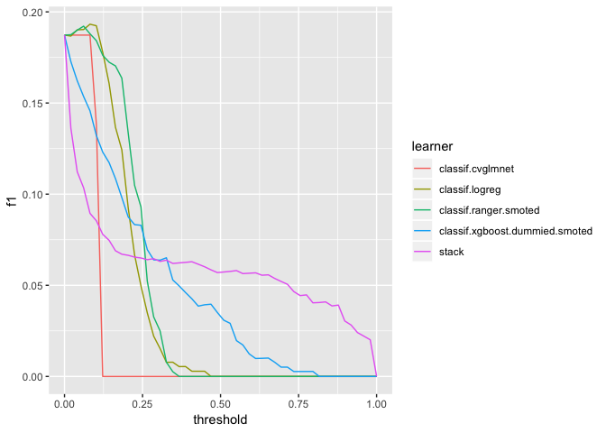

submit predictions
==================

``` r
optimal_thresh <- list(learner = b$learner[which.max(as.matrix(b$f1))], 
                       thresh = b$threshold[which.max(as.matrix(b$f1))], 
                       f1 = b$f1[which.max(as.matrix(b$f1))], 
                       precision = b$precision[which.max(as.matrix(b$f1))], 
                       recall = b$recall[which.max(as.matrix(b$f1))])

parallelStart(mode="multicore",cpus=14,level="mlr.tuneParams")
tuned_params <- tuneParams(
  learner = ranger_lrn,
  task = churn_task,
  resampling = resample_desc,
  par.set = ranger_params,
  control = control, 
  measures = f1
)
parallelStop()

ranger_lrn <- setHyperPars(
  learner = ranger_lrn,
  par.vals = tuned_params$x
)

final_model <- train(ranger_lrn, churn_task)

Mode <- function(x) {
  ux <- na.omit(unique(x))
  ux[which.max(tabulate(match(x, ux)))]
}

test_data <- users %>% filter(dataset == "test") %>% 
  mutate(local_subscription_hour = replace(local_subscription_hour, is.na(local_subscription_hour), Mode(local_subscription_hour)), 
         subscripiton_day_of_week = replace(subscripiton_day_of_week, is.na(subscripiton_day_of_week), Mode(subscripiton_day_of_week))
         )

predictions <- predict(final_model, newdata = test_data)
predictions <- setThreshold(predictions, optimal_thresh$thresh)

submission <- data.frame(id = test_data$id, churned = predictions$data$response)
write.csv(submission, "submission.csv", row.names = F)
```
